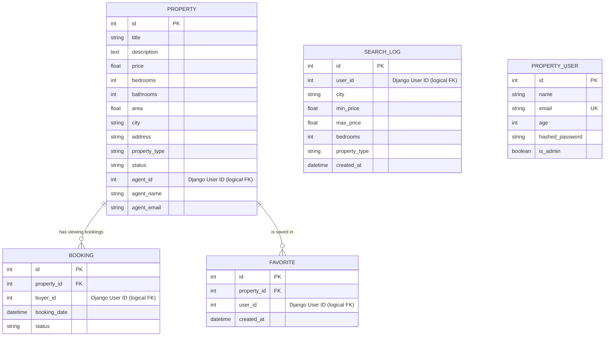
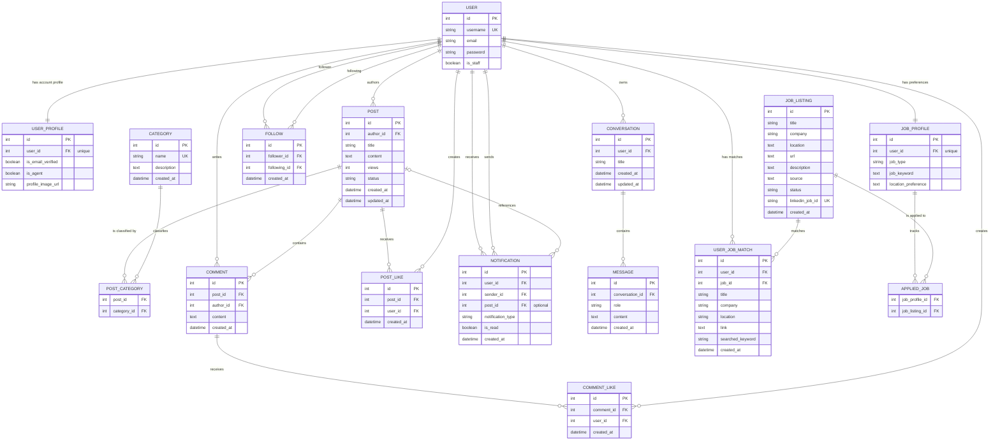
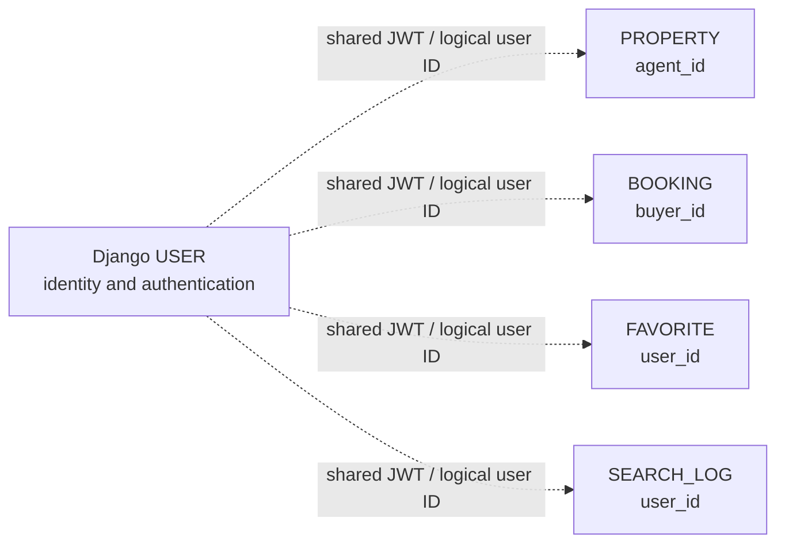

# EstateHub ER Diagram

EstateHub has **two PostgreSQL databases**: one for `property-service` (FastAPI) and one for `notification-service` (Django). The diagrams below use the Crow's Foot notation rendered by Mermaid. `PK` means primary key and `FK` means foreign key.

## 1. Property service database

`PROPERTY_USER` is a legacy FastAPI users table used by the service's REST user endpoints. The active GraphQL property flows instead identify users from the shared JWT and store the Django user ID in `agent_id`, `buyer_id`, and `user_id`; those values are **logical** rather than physical foreign keys. A property can have many bookings and favourites. Search logs are independent records used to calculate recommendations.

## 2. Notification service database

## Cross-service relationship

## Important constraints

- `POST_LIKE` is unique per `(post_id, user_id)` and `COMMENT_LIKE` per `(comment_id, user_id)`.
- `FOLLOW` is unique per `(follower_id, following_id)`.
- `USER_JOB_MATCH` is unique per `(user_id, job_id)`.
- `PROPERTY` to `BOOKING` and `PROPERTY` to `FAVORITE` are physical database foreign-key relationships. User references inside the property database are IDs validated through authentication, not cross-database constraints.
