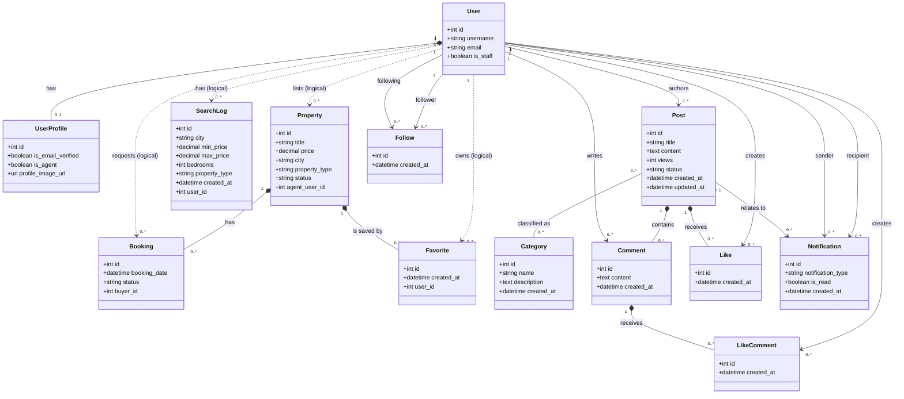

# EstateHub Object Model

This document describes the domain objects used by EstateHub for an object-model diagram. It deliberately excludes the **job** and **chat** features. The application has two services and two databases: Django owns identities and community content; FastAPI owns property-related data.

## Diagram scope and notation

- `1` means exactly one; `0..1` means zero or one; `0..*` means zero or many.
- An association labelled **logical user reference** crosses service/database boundaries. It stores a Django `User.id`, but it is not a physical database foreign key.
- `User` is the Django account object. An agent is a `User` whose `UserProfile.is_agent` is `true`; it is not a separate persisted class.
- The `PropertyUser` table in the property service is a legacy REST-authentication table. It is not part of the active EstateHub object model, whose authenticated identity is Django `User`.

## Primary domain objects

### User and profile

| Object | Key attributes | Responsibility |
| --- | --- | --- |
| `User` | `id`, `username`, `email`, `password`, `is_staff` | Authenticated account and identity. It can act as a buyer, an agent, a blog author, a follower, or a notification recipient. |
| `UserProfile` | `id`, `is_email_verified`, `is_agent`, `profile_image_url` | Extends a user account with verification, agent-role, and profile-image information. |

Association: `User 1 ── 0..1 UserProfile`. Each profile belongs to exactly one user, and a profile cannot exist without that user.

### Property discovery and viewing

| Object | Key attributes | Responsibility |
| --- | --- | --- |
| `Property` | `id`, `title`, `description`, `price`, `bedrooms`, `bathrooms`, `area`, `city`, `address`, `property_type`, `status`, `agent_user_id`, `agent_name`, `agent_email` | A real-estate listing created and managed by an agent. |
| `Booking` | `id`, `booking_date`, `status`, `property_id`, `buyer_id` | A buyer's request to view a property. |
| `Favorite` | `id`, `created_at`, `property_id`, `user_id` | A saved-property record for a user. It is the association object between a user and a property. |
| `SearchLog` | `id`, `city`, `min_price`, `max_price`, `bedrooms`, `property_type`, `created_at`, `user_id` | A record of a user's search criteria, used as recommendation input. |

Property-side associations:

- `User (agent) 1 ── 0..* Property`: a property has one listing agent through `agent_user_id`; an agent can list many properties. This is a **logical user reference**.
- `Property 1 ── 0..* Booking`: each booking concerns one property; a property can have many bookings.
- `User (buyer) 1 ── 0..* Booking`: each booking has one buyer through `buyer_id`; a buyer can request many viewings. This is a **logical user reference**.
- `User 1 ── 0..* Favorite` and `Property 1 ── 0..* Favorite`: a favorite links one user to one property. It represents a many-to-many “user saves property” relationship.
- `User 1 ── 0..* SearchLog`: each search log belongs to one user through `user_id`. This is a **logical user reference**.

### Community content

| Object | Key attributes | Responsibility |
| --- | --- | --- |
| `Post` | `id`, `title`, `content`, `views`, `status`, `created_at`, `updated_at`, `author_id` | A blog article created by a user; status is `draft` or `published`. |
| `Category` | `id`, `name`, `description`, `created_at` | A reusable classification for blog posts. |
| `Comment` | `id`, `content`, `created_at`, `post_id`, `author_id` | A user's comment on a post. |
| `Like` | `id`, `created_at`, `post_id`, `user_id` | A user's like of a post; association object between user and post. |
| `LikeComment` | `id`, `created_at`, `comment_id`, `user_id` | A user's like of a comment; association object between user and comment. |
| `Follow` | `id`, `created_at`, `follower_id`, `following_id` | A directed self-association: one user follows another user. |
| `Notification` | `id`, `notification_type`, `is_read`, `created_at`, `user_id`, `sender_id`, `post_id?` | A notification sent from one user to another, optionally relating to a post. |

Community associations:

- `User 1 ── 0..* Post`: each post has one author; a user may author many posts.
- `Post 0..* ── 0..* Category`: posts can belong to many categories and categories can classify many posts. Django persists this through an implicit `PostCategory` join table.
- `Post 1 ── 0..* Comment` and `User 1 ── 0..* Comment`: every comment has one post and one author.
- `User 1 ── 0..* Like` and `Post 1 ── 0..* Like`: `Like` represents the many-to-many post-like relationship.
- `User 1 ── 0..* LikeComment` and `Comment 1 ── 0..* LikeComment`: `LikeComment` represents the many-to-many comment-like relationship.
- `User 1 ── 0..* Follow (follower)` and `User 1 ── 0..* Follow (following)`: a follow record has one follower and one followed user.
- `User 1 ── 0..* Notification (recipient)` and `User 1 ── 0..* Notification (sender)`: each notification has one recipient and one sender.
- `Post 0..1 ── 0..* Notification`: a notification can optionally refer to one post; a post can be referenced by many notifications.

## Constraints and business rules

- A `UserProfile` is one-to-one with `User`.
- `Category.name` is unique.
- A user can like a particular post only once: `Like(post_id, user_id)` is unique.
- A user can like a particular comment only once: `LikeComment(comment_id, user_id)` is unique.
- A directed user pair can have only one follow record: `Follow(follower_id, following_id)` is unique.
- A booking is associated with exactly one property and one buyer. The booking flow returns an existing booking when that buyer already has one for the property.
- `Property.agent_user_id`, `Booking.buyer_id`, `Favorite.user_id`, and `SearchLog.user_id` contain Django user IDs. They are validated through authentication/JWT context rather than cross-database foreign-key constraints.
- Only a user with `UserProfile.is_agent = true` can create and manage property listings. The listing agent can manage the status of bookings on their properties.
- A `Notification.post` is optional because follow notifications do not concern a post.

## Mermaid class diagram source

Use this as a direct starting point for a rendered object model diagram. Dashed links identify logical cross-service user references.

